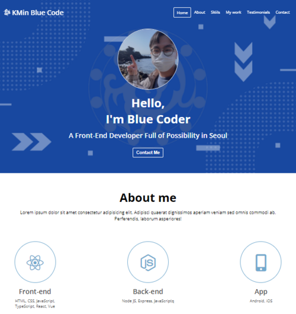
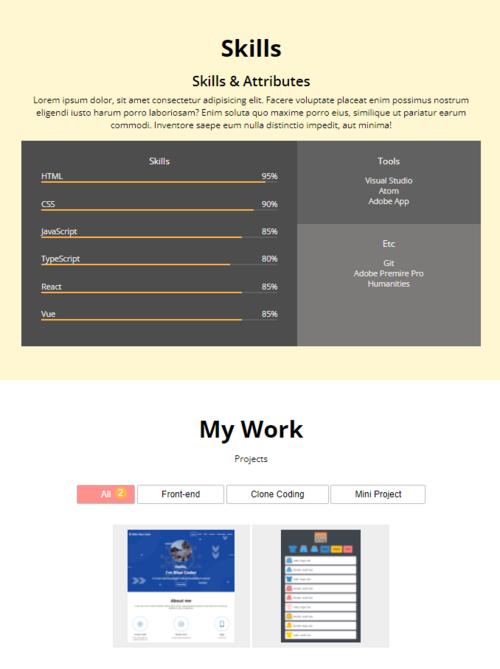
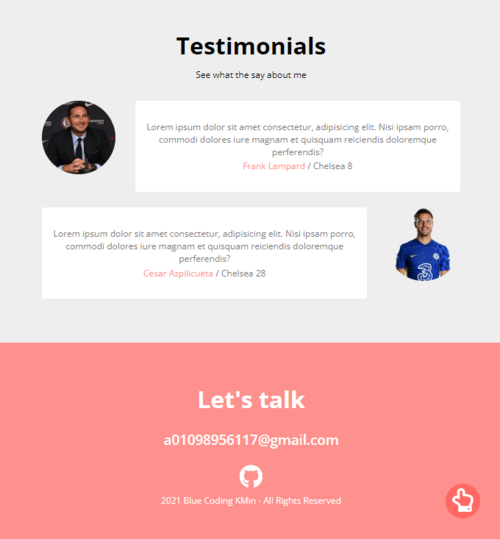
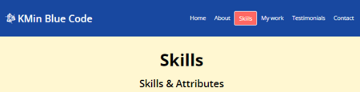
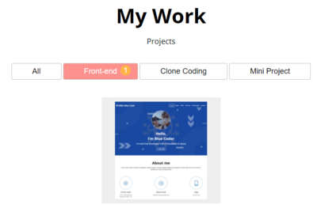
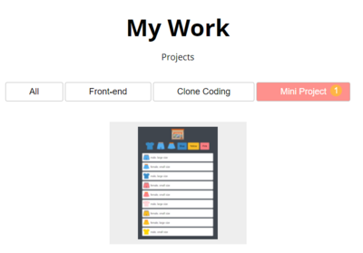
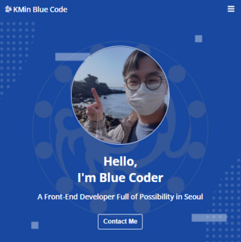
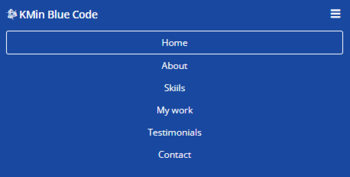
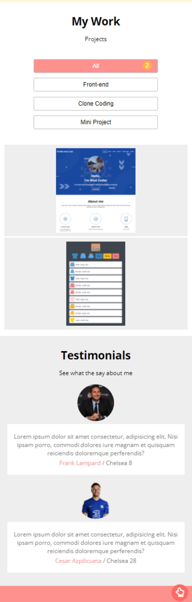

# KMin's Portfolio Project !!

## 메인화면, RESULT (Navbar, Header, About)
 

  

# 📑 프로젝트의 목적
1. 개발자로서 커리어를 이어갈 나란 사람을 소개하고, 어떤 기술과 스택을 가지고, 어떤 프로젝트를 진행해왔는지 한 눈에 볼 수 있는 포트폴리오 웹페이지 프로젝트를 만들기
1. 어떤 분야를 주로 공부하고 개발해왔으며, 어떤 프로젝트가 진행됐는지 표시하고, 깃허브 페이지 링크를 달아서 이동할 수 있도록 하기
1. 반응성을 갖는 동적인 페이지로 포트폴리오 웹페이지를 구성하여 PC 와 태블릿, 모바일에 대응할 수 있도록 하기
1. 사용자 편의를 위해서 네비게이션 바로 해당하는 섹션으로 바로 이동할 수 있고, 현재 섹션의 위치를 네비게이션 바에 표시하기
  

# 📌 프로젝트에 사용한 기술들
- HTML, CSS, JavsScript
- webpack : npm 패키지들과 처리를 위해, 그리고 추가적인 프로젝트 확장이 가능하도록 webpack 을 사용해서 프로젝트를 제작
- Postcss: scss 등의 전처리를 위해 사용
- Babel: JavaScript 로 작성한 코드를 다양한 브라우저에서 이해할 수 있도록 변환시킬 수 있도록 사용
- Scss : 표준CSS3 를 사용하면서 불필요하게 코드가 길어지는 것을 막고 효율적으로 스타일링을 하기 위해 사용
  

# 💾 구현사항
 

## 1. 전체 화면 구성
 

 네비게이션바, 헤더와 어바웃 섹션 

 skills 섹션과 MyWork 섹션 

 
Testimonials(추천사) 섹션과 contact 섹션
   

## 2. 네비게이션바 활성화와 빠른 이동
 

 
네비게이션바가 상단에 고정되고, 스크롤을 내리면 현재 스크롤이 위치한 섹션의 네비게이션 탭이 활성화됨  
 

## 3. 현재 완료된 포트폴리오 목록 보여주기
 

 
 
 
 

각각 전체 또는 카테고리에 맞는 버튼을 클릭하면 그에 맞는 포트폴리오 목록들을 보여줌 
일일히 포트폴리오 목록을 html 에 하드코딩하지 않고 데이터에 필요한 정보를 입력하면 JavaScript 로 DOM 요소에 추가해서 목록을 구성함 
각 버튼 옆의 숫자는 포트폴리오 목록 개수를 반영하고, 
각 포트폴리오 아이템을 클릭하면 Github 페이지 링크로 이동함
  

## 4. 다양한 플랫폼에 반응하는 동적인 웹페이지 구성
 

 
뷰포트 가로너비가 감소하면 상단 네비게이션바가 햄버거 메뉴로 축소됨  
 
햄버거 메뉴를 클릭하면 네비게이션바 메뉴들이 세로로 정렬이되고, 클릭할 경우 마찬가지로 해당 섹션으로 이동하고, 현재 스크롤이 위치한 메뉴탭이 활성화됨  
 
가로 너비가 줄어들어 각 요소들이 세로정렬이 된 상태  
 

# ✍ 느낀점, 감상
 

직접 취업하는데 사용할 포트폴리오 웹사이트를 클론 코딩하면서 다시 한번 기초적인 html, css, JS 를 복습할 수 있었다. 
강의 내용을 단순히 따라하기만 하지 않고 나의 개성을 표현할 수 있는 포트폴리오 페이지를 만들어보려고 했고, 
webpack 을 도입해서 이후에 체계적인 프로젝트 확장과 효율적인 수정, 관리를 할 수 있도록 하려고 했다. 
 
특히나 이 포트폴리오 프로젝트를 구성하면서 느낀 점은, 나는 여전히 많이 부족하고 아직 이룬 것이 많이 없지만, 
동시에 여기에 하나하나씩 채워나가면 된다는 생각으로 임할 수 있어서 더 큰 동력을 얻을 수 있는 계기가 된 프로젝트를 해서 다행이었다는 점이다. 
 
좀 더 공부를 해서 데이터 파일을 직접 두는 것보다, 백엔드를 구성해서 해당 백엔드에 내 포트폴리오 정보를 올리는 것으로 대체하면 좋겠다는 생각이 들었다.